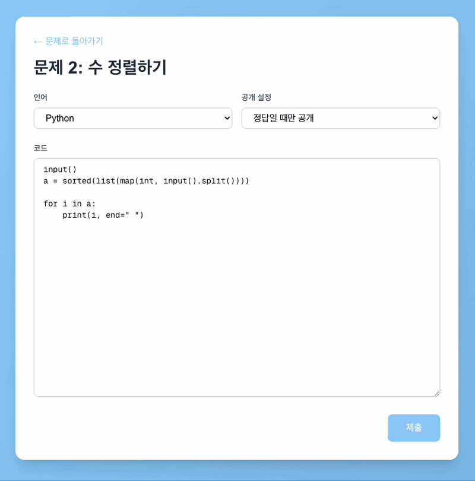
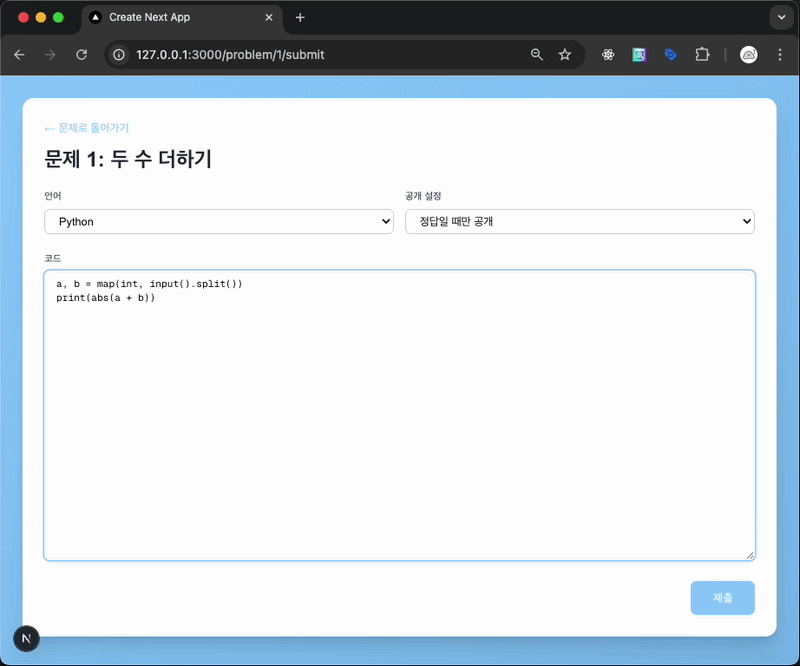
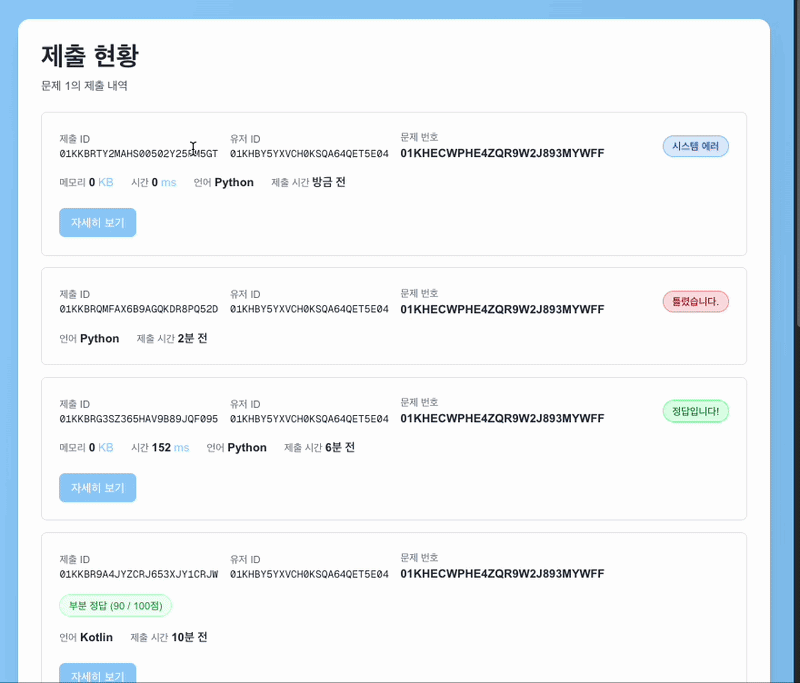
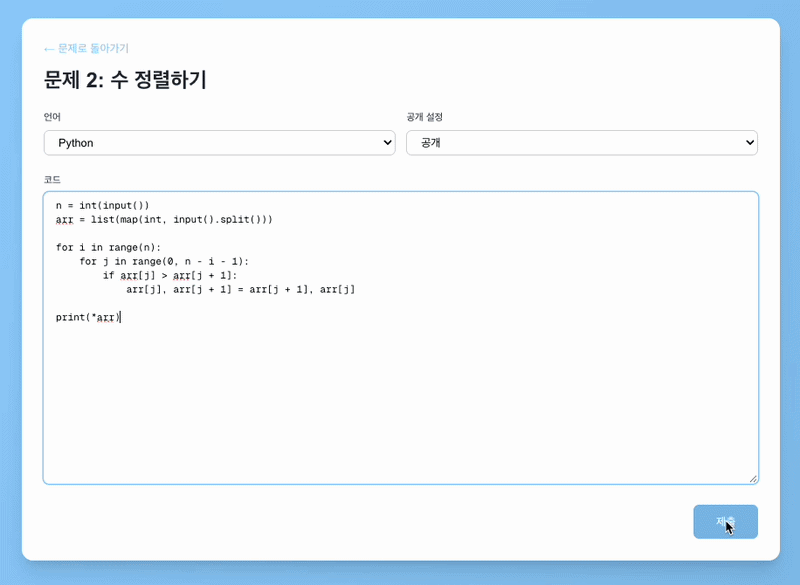
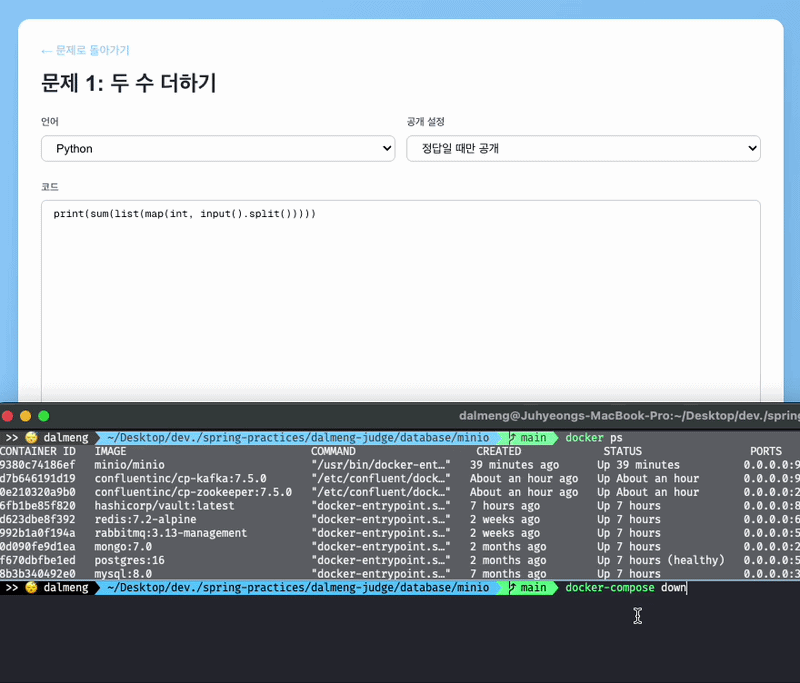
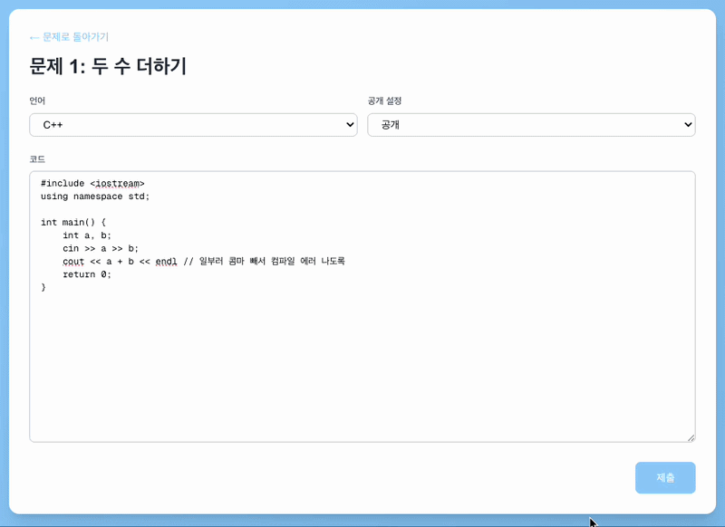

# 🎬 데모 영상 모음

> 채점 시스템의 다양한 케이스를 직접 시연한 영상 모음입니다.  
> 각 목차를 클릭하면 해당 영상으로 바로 이동합니다.

 

## 목차

1. [🟢 기본 채점](#1-기본-채점)
2. [🟡 부분 정답 (PARTIAL)](#2-부분-정답-partial)
3. [🔁 재채점](#3-재채점)
4. [⏱️ 시간 초과 (TLE)](#4-시간-초과-tle)
5. [💥 시스템 에러 (SYSERR)](#5-시스템-에러-syserr)
6. [🔨 컴파일 에러 (CE)](#6-컴파일-에러-ce)
7. [🔴 런타임 에러 (RE)](#7-런타임-에러-re)

 

## 1. 기본 채점

코드를 제출하고 채점을 받는 가장 기본적인 케이스다.

- 채점 현황을 실시간으로 확인할 수 있다.
- 채점 완료 후 테스트케이스별 결과를 상세히 확인할 수 있다.
- 각 테스트케이스의 입력값과 출력값도 함께 제공된다.
- 서브태스크별 채점 결과도 확인할 수 있다.

---

 

## 2. 부분 정답 (PARTIAL)

두 수의 합을 구하는 문제에서 **서브태스크 1만 통과**하도록 의도한 케이스다.

- 두 수의 합 대신 **절댓값**을 출력하도록 코드를 작성했다.
- 서브태스크 1은 두 수가 모두 양수인 케이스이므로 통과, 나머지는 오답 처리된다.
- 최종 점수는 서브태스크 1의 배점인 **10점**이 나와야 한다.

| 문제 정보 | 서브태스크 구성 |
|-----------|----------------|
|  |  |

**채점 결과 상세**

전체 채점 결과가 `PARTIAL`로 표시되며, 최종 점수 **10점**을 확인할 수 있다.

서브태스크별로 펼쳐보면, 서브태스크 1은 통과, 나머지는 오답인 것을 확인할 수 있다.

실패한 테스트케이스를 클릭하면 입력값, 예상 출력, 실제 출력 등 상세 정보를 확인할 수 있다.

---

 

## 3. 재채점

시스템 에러 등 예상치 못한 오류로 채점이 정상적으로 완료되지 않았을 때 재채점을 요청할 수 있다.

- 일반 채점과 동일한 방식으로 처리되며, **실시간으로 결과를 확인**할 수 있다.
- 재채점 API는 해당 제출의 **원 제출자만 요청**할 수 있다. (Bearer Token으로 본인 여부 검증)
- 시연 영상에서는 `curl`로 재채점 API를 호출하고, 그 결과를 브라우저에서 실시간으로 확인한다.

---

 

## 4. 시간 초과 (TLE)

배열을 정렬하는 문제에서 **비효율적인 알고리즘**으로 시간 초과를 유도한 케이스다.

- 일부러 O(n²) 정렬 코드로 제출하여 큰 입력에서 TLE가 발생하도록 했다.

입력 크기 10,000인 테스트케이스는 통과했지만, 입력 크기 50,000인 35번째 테스트케이스부터 TLE가 발생한 것을 확인할 수 있다.

> 이 문제의 기본 시간 제한은 2초이나, Python은 언어 특성을 고려하여 추가 시간이 부여된다.  
> 언어별 리소스 제한 기준은 [BOJ 언어별 정보](https://help.acmicpc.net/language/info)를 참고했다.

---

 

## 5. 시스템 에러 (SYSERR)

예상치 못한 서버 오류로 채점 자체가 실패한 케이스다.

- 시연에서는 테스트케이스를 관리하는 **스토리지 서버(MinIO)를 의도적으로 종료**하여 시스템 에러를 발생시켰다.
- 이처럼 채점 중 복구 불가능한 오류가 발생하면 제출이 시스템 에러로 처리된다.
- 이 경우 [재채점](#3-재채점) 기능을 통해 다시 채점을 요청할 수 있다.

---

 

## 6. 컴파일 에러 (CE)

제출한 코드가 **컴파일 단계에서 실패**한 케이스다.

- 시연에서는 C++ 코드에서 세미콜론을 의도적으로 제거하여 컴파일 에러를 발생시켰다.

---

 

## 7. 런타임 에러 (RE)

제출한 코드가 **실행 중 예외가 발생**하여 비정상 종료된 케이스다.

- 시연에서는 두 수의 합을 구하는 문제 코드에 **0으로 나누는 로직을 추가**하여 런타임 에러를 발생시켰다.

채점 결과에서 `ArithmeticException`이 발생했음을 확인할 수 있다.