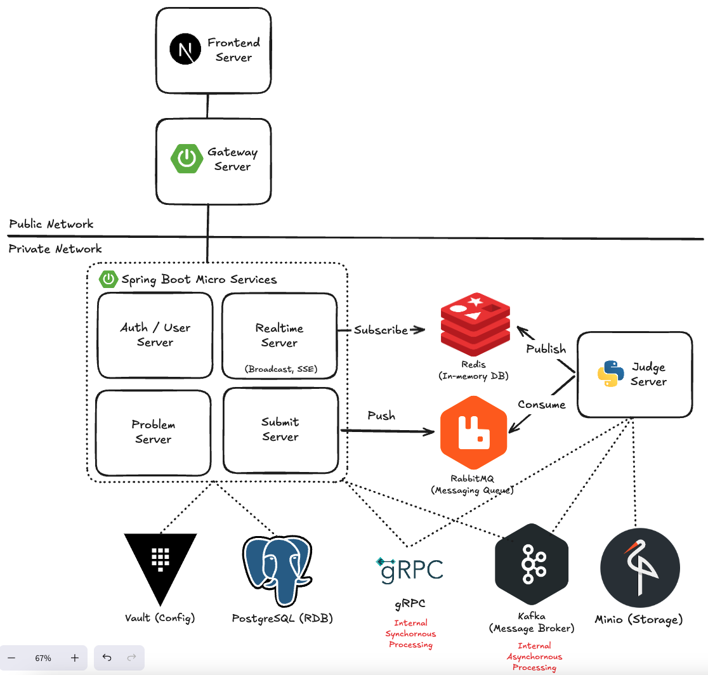

# ⚖️ 채점 서버 원리와 인프라 

> 채점 서버는 Submit Server에서 접수된 요청을 메시징 큐를 통해 받아 처리합니다.  
> 다른 서버와 직접 연결되지 않고, 큐와 메시지 브로커를 통해 **완전한 비동기 구조**로 동작합니다.  
> **한 번에 하나의 채점만 처리**하며, MSA 원칙에 따라 채점이라는 단일 책임에만 집중합니다.

<br/>

## 목차

1. [💡 채점은 어떤 과정으로 이루어질까?](#1-채점은-어떤-과정으로-이루어질까)
2. [🗺️ 3개의 채점 서버에 4개의 채점 요청을 동시에 날린다면?](#2-3개의-채점-서버에-4개의-채점-요청을-동시에-날린다면)
3. [🏗️ 아키텍처](#3-아키텍처)
4. [🔧 기술 선택 이유](#4-기술-선택-이유)
5. [🧩 기타 인프라](#5-기타-인프라)
6. [📄 코드 리포지토리](#코드)

<br/>

## 1. 채점은 어떤 과정으로 이루어질까?

```
사용자 → Submit Server → DB 저장 + 메시징 큐 적재 → 응답
-------------------------------------------------
              ↓
Judge Server (큐에서 꺼내 채점 시작)
```

**① 제출 접수 (Submit Server)**
- 사용자가 Submit Server로 채점 요청을 보내고, 제출 페이지로 이동한다.
- Submit Server는 DB에 채점 데이터를 `RUNNING` 상태로 저장하고, 메시징 큐에 채점 요청을 적재한다.
- 이후 사용자에게 **즉시 응답**을 반환한다. (큐 적재 후 블로킹 없음)

**② 채점 준비 (Judge Server)**
- 큐에서 채점 데이터를 꺼내 처리를 시작한다.
- gRPC를 통해 해당 사용자 정보, 문제 정보를 조회한다.
- 원격 스토리지(MinIO)에서 테스트케이스를 가져온다.
- 코드를 컴파일한다.

**③ 채점 진행**
- 서브프로세스에서 테스트케이스별 채점을 진행한다.
- 채점 상태가 변할 때마다 **Redis에 현황을 업데이트**한다.
  - 전체 진행률 (몇 % 완료)
  - 현재 진행 중인 서브태스크 번호
  - 테스트케이스별 결과 등

**④ 채점 마무리**
- 채점 결과를 취합하여 최종 결과 데이터를 구성한다.
- **채점 완료 이벤트를 Kafka로 발행**한다. 이후 처리는 각 서비스에 위임한다.

**⑤ 실시간 현황 수신 (클라이언트)**
- 사용자가 제출 페이지에 접속하는 순간, **Realtime Server와 SSE로 연결**된다.
- Realtime Server는 Redis의 채점 현황 토픽을 구독하고 있다가, 변경이 감지되면 연결된 모든 클라이언트에게 브로드캐스팅한다.

**⑥ 채점 완료 이벤트 처리 (Problem / Submit Server)**

| 서버 | 처리 내용 |
|------|-----------|
| Problem Server | 해당 문제의 제출 수, 정답 수 카운트 업데이트 |
| Submit Server | 채점 요청 상태를 최종 결과(AC / WA / TLE 등)로 변경 |

두 서버 모두 Kafka 이벤트를 구독하여 **비동기로 처리**한다.

---

<br />

## 2. 3개의 채점 서버에 4개의 채점 요청을 동시에 날린다면?

채점 서버 3개, 채점 요청 4개를 동시에 보내는 시나리오다.

**예상 동작**
- 채점 서버는 각각 한 번에 하나의 채점만 처리하므로, 요청 A·B·C가 먼저 처리된다.
- 요청 D는 큐에서 대기 상태를 유지한다.
- A·B·C 중 하나가 채점을 완료하는 순간, 해당 서버가 즉시 큐에서 D를 꺼내 처리를 시작한다.

**시연 영상**


> 영상 오른쪽 아래의 네 번째 채점 요청이, 나머지 세 요청 중 하나가 완료될 때까지 대기하다가 이후 처리되는 것을 확인할 수 있다.

[](https://vimeo.com/manage/videos/1172569585)

---

<br />

## 3. 아키텍처



---

<br />

## 4. 기술 선택 이유

### 🐇 RabbitMQ — 채점 요청 큐

채점 서버가 직접 API를 받아 처리한다면 아래 문제가 생긴다.

- 한 번에 하나의 채점만 처리하려면, 처리 중 들어오는 모든 요청을 거절하거나 블로킹해야 한다.
- 채점이 끝날 때까지 API 커넥션을 유지하면, 서비스 간 결합도가 높아지고 스레드 자원 낭비가 심해진다. (특히 요청당 스레드를 할당하는 Spring에서는 더욱 두드러진다.)

RabbitMQ를 사용하면 이 문제가 자연스럽게 해결된다.

- Submit Server는 큐에 요청을 넣고 **즉시 응답**을 반환한다.
- Judge Server는 현재 처리가 끝난 후에만 큐에서 다음 요청을 꺼낸다. **(자연스러운 순차 처리)**
- 도착 순서대로 채점하는 일반적인 온라인 저지의 동작 방식과도 잘 맞는다.

---

### 🔴 Redis — 실시간 채점 현황

Redis가 없다면 사용자는 채점이 완료될 때까지 *"채점 중..."* 메시지만 보게 된다.

- Judge Server는 채점 상태가 변할 때마다 Redis에 현황을 발행(Publish)한다.
- Realtime Server는 해당 토픽을 구독(Subscribe)하고 있다가, 변경을 감지하면 SSE로 연결된 모든 클라이언트에게 브로드캐스팅한다.
- 덕분에 사용자는 BOJ, Codeforces처럼 **테스트케이스별 채점 현황을 실시간으로** 확인할 수 있다.

---

### 🟠 Kafka — 채점 완료 이벤트 처리

채점 서버가 채점 후 처리(결과 저장, 카운트 업데이트 등)를 직접 담당하면, 채점 서버는 다른 서비스의 요구사항을 의식하게 된다. 이는 MSA의 단일 책임 원칙에 어긋난다.

- Judge Server는 채점 과정에서 얻은 데이터를 이벤트로 발행하는 것까지만 담당한다.
- 이 이벤트를 필요로 하는 서비스(Problem, Submit Server)가 각자 구독하여 알아서 처리한다.
- 덕분에 채점 서버는 **채점이라는 역할에만 집중**할 수 있고, 새로운 서비스가 추가되더라도 채점 서버를 수정할 필요가 없다.

---

<br />

## 5. 기타 인프라

### Docker Compose

실제 프로덕션 환경이라면 Helm Chart 기반으로 Kubernetes 배포를 구성했을 것이다.  
본 프로젝트에서는 간결한 배포를 위해 Docker Compose를 사용했다.

아래는 `docker ps` 결과로, 백엔드 인프라 컨테이너들이 동시에 실행되고 있는 모습이다.


- PostgreSQL, RabbitMQ, Kafka, MinIO, Vault 등이 함께 동작하고 있다.

<br />

---

### 데이터베이스 분리


MSA에서는 서비스별로 데이터베이스 인스턴스를 완전히 분리하는 것이 이상적이다.  
본 프로젝트에서는 **인스턴스 분리보다 접근 권한 분리**에 초점을 두었다.

- 각 마이크로서비스는 자신이 소유한 데이터베이스에만 접근할 수 있다.
- 다른 서비스의 데이터베이스에는 접근 자체가 불가능하도록 구성했다.

---

<br />

### 시크릿 관리 — Vault


- 기존에 Infisical을 사용한 경험이 있어, 유사한 솔루션인 Vault를 로컬 환경에 배포하여 사용했다.
- 각 마이크로서비스는 Vault에서 Secret을 안전하게 가져온 뒤 서버를 실행한다.
- 환경변수나 설정 파일에 민감 정보가 평문으로 노출되지 않는다.

---

<br />

### 테스트케이스 스토리지 — MinIO


- 채점 서버가 여러 인스턴스로 수평 확장될 수 있기 때문에, 테스트케이스를 각 서버 로컬에 저장하는 방식은 적합하지 않다.
- MinIO는 AWS S3 SDK와 완전히 호환되므로, 추후 실제 S3로 교체하더라도 코드 변경이 거의 없다.
- 모든 채점 서버 인스턴스가 동일한 테스트케이스에 접근할 수 있어, **수평 확장에 자유롭다.**


---

### 코드

> 서비스의 모든 코드는 공개되어 있습니다. 

| 서비스 | 설명 | 링크 |
|--------|------|------|
| Auth | 인증 및 사용자 서비스 | [리포지토리 이동](https://github.com/dm-judge/dm-judge-backend-auth) |
| Problem | 문제 관리 서비스 | [리포지토리 이동](https://github.com/dm-judge/dm-judge-backend-problem) |
| Submit | 제출 데이터 관리 서비스 | [리포지토리 이동](https://github.com/dm-judge/dm-judge-backend-submit) |
| Realtime | SSE 스트리밍 서비스 | [리포지토리 이동](https://github.com/dm-judge/dm-judge-backend-realtime) |
| Judge | 채점 서버 | [리포지토리 이동](https://github.com/dm-judge/dm-judge-backend-judge) |
| Inference | LLM 문제 생성 파이프라인 | [리포지토리 이동](https://github.com/dm-judge/dm-judge-inference) |
| Gateway | Spring Cloud Gateway | [리포지토리 이동](https://github.com/dm-judge/dm-judge-backend-gateway) |
| Flyway | 데이터베이스 스키마 중앙 관리 | [리포지토리 이동](https://github.com/dm-judge/dm-judge-database-flyway) |
| Infra | 기타 인프라 Docker Compose | [리포지토리 이동](https://github.com/dm-judge/dm-judge-database) |