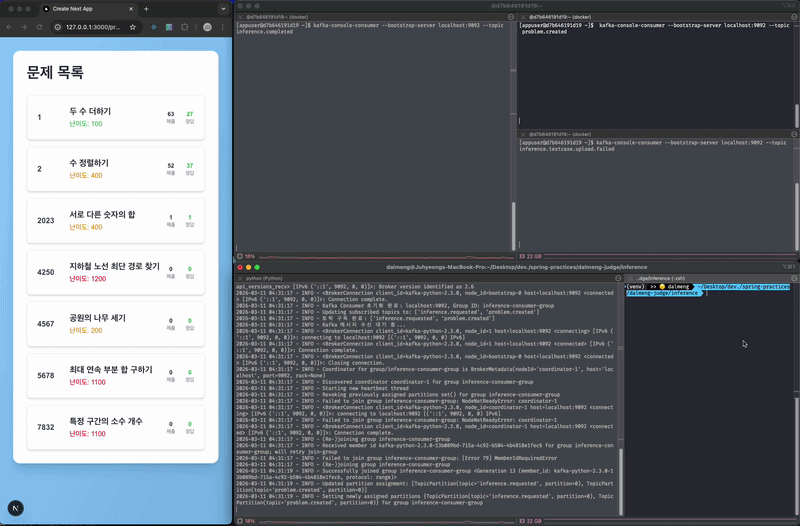
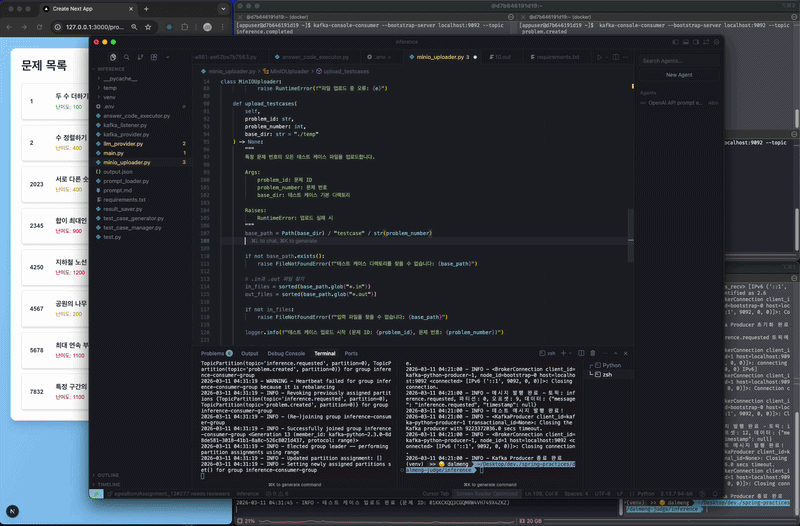

# 🤖 LLM 문제 자동 생성 & SAGA 패턴

> LLM을 활용하여 코딩 문제를 자동으로 생성하고, 분산 환경에서 발생할 수 있는 부분 실패를 SAGA 패턴으로 안전하게 처리한다.

<br/>

## 목차

1. [💡 문제 생성 흐름](#1-문제-생성-흐름)
2. [🎬 문제 생성 시연](#2-문제-생성-시연)
3. [🔄 SAGA 패턴 적용](#3-saga-패턴-적용)
4. [🎬 SAGA 패턴 시연](#4-saga-패턴-시연)

---

## 1. 문제 생성 흐름

```
inference.requested 이벤트 수신
        ↓
LLM Call — 문제 정보 + inputGeneratorCode + answerCode 생성
        ↓
inputGeneratorCode 실행 → 테스트케이스 입력 데이터 생성
        ↓
answerCode 실행 → 테스트케이스 출력 데이터 생성
        ↓
inference.completed 이벤트 발행
        ↓
┌───────────────────────┬───────────────────────────────┐
│   Inference Server    │       Problem Server          │
│ 테스트케이스를            │ 문제 생성                       │
│ 원격 스토리지에 저장       │ → problem.created 이벤트 발행    │
└───────────────────────┴──────────────┬────────────────┘
                                       ↓
                               Submit Server
                              서브태스크 정보 생성
```

<br />

**각 서비스의 역할 요약**

| 서비스 | 구독 이벤트 | 처리 내용 |
|--------|------------|-----------|
| Inference Server | `inference.completed` | 테스트케이스를 원격 스토리지(MinIO)에 저장 |
| Problem Server | `inference.completed` | 문제 생성 후 `problem.created` 이벤트 발행 |
| Submit Server | `problem.created` | 서브태스크 정보 생성 |

---

<br />

**LLM에게 요청하는 내용**

LLM은 아래 세 가지를 한 번의 호출로 생성한다.

- **문제 정보** — 제목, 본문, 입출력 형식, 제한 조건, 예제, 난이도 등
- **`inputGeneratorCode`** — 테스트케이스 입력 데이터를 생성하는 코드
- **`answerCode`** — 해당 문제의 정답 코드 (출력 데이터 생성에 사용)

> 문제 생성에 사용된 프롬프트 전문은 [여기](https://github.com/dm-judge/dm-judge-inference/blob/main/prompt.md?plain=1)에서 확인할 수 있습니다.

<br />

**LLM 출력 예시**

```json
{
  "userId": "01KHBY5YXVCH0KSQA64QET5E04",
  "title": "홀수와 짝수의 합",
  "description": "자연수 `N`이 주어질 때, 1부터 `N`까지의 숫자들 중 홀수의 합과 짝수의 합을 구하는 프로그램을 작성하라.",
  "input": "첫 줄에 자연수 `N`이 주어진다.",
  "output": "첫 줄에 1부터 `N`까지의 숫자들 중 홀수의 합과 짝수의 합을 공백으로 구분하여 출력한다.",
  "restrictions": "`N`은 1 이상 10,000 이하의 자연수이다.",
  "timeLimit": 1000,
  "memoryLimit": 128,
  "difficulty": 200,
  "numOfTestcases": 8,
  "examples": [
    {
      "inputData": "5\n",
      "outputData": "9 6\n",
      "explanation": "1부터 5까지의 숫자 중, 홀수는 1, 3, 5이고 합은 9이다. 짝수는 2, 4이고 합은 6이다.",
      "displayOrder": 1
    },
    {
      "inputData": "10\n",
      "outputData": "25 30\n",
      "explanation": "1부터 10까지의 숫자 중, 홀수는 1, 3, 5, 7, 9이고 합은 25이다. 짝수는 2, 4, 6, 8, 10이고 합은 30이다.",
      "displayOrder": 2
    }
  ],
  "answerCode": "def calculate_sums(n):\n    odd_sum = sum(i for i in range(1, n + 1) if i % 2 != 0)...(생략)",
  "inputGeneratorCode": "import os\nimport random\n\ndef generate_test_case(testcase_number, n):...(생략)"
}
```

---

<br />

## 2. 문제 생성 시연

<div align="center">



[](https://vimeo.com/1172569420)

</div>

| 타임스탬프 | 내용 |
|-----------|------|
| 00:01 | `inference.requested` 이벤트를 발행하여 문제 생성을 시작한다 |
| 00:13 | `inference.completed`, `problem.created` 메시지가 수신되며 문제 생성이 완료된다 |
| 00:17 | 페이지를 새로고침하면 새로 생성된 문제가 목록에 나타난다 |

---

<br />

## 3. SAGA 패턴 적용

### 왜 SAGA 패턴이 필요한가?

문제 생성은 **여러 서비스에 걸친 분산 작업**이다.  
각 서비스는 독립적으로 트랜잭션을 관리하기 때문에, 중간 단계에서 실패가 발생하면 이전 단계의 결과만 DB에 남아 데이터 불일치가 발생할 수 있다.

예를 들어, **테스트케이스 업로드에 실패**한 경우를 생각해보자.

```
inference.completed 수신
        ↓
Problem Server  → 문제 생성 완료 (DB에 저장됨)
Inference Server → 테스트케이스 업로드 실패 ← 여기서 크래시
        ↓
문제는 DB에 존재하지만, 테스트케이스가 없어 채점 불가능한 상태
```

이 상태를 방치하면, 채점 요청 시 테스트케이스를 찾지 못해 시스템 에러가 발생한다.  
따라서 **실패가 감지되면 이전 단계의 작업을 원상복구**해야 한다.

---

### 보상 트랜잭션 (Compensating Transaction)

분산 환경에서는 이미 커밋된 트랜잭션을 직접 롤백할 수 없다.  
대신 **반대 동작을 수행하는 이벤트를 발행**하여 이전 상태로 되돌리는 것이 보상 트랜잭션이다.

```
테스트케이스 업로드 실패
        ↓
inference.testcase.upload.failed 이벤트 발행
        ↓
Problem Server — 보상 트랜잭션 실행 (문제 삭제)
        ↓
DB cascade로 Submit Server의 서브태스크 데이터도 함께 삭제
        ↓
원상복구 완료
```

Problem Server의 이벤트 수신 및 보상 트랜잭션 처리 코드는 아래와 같다.

```kotlin
@KafkaListener(
    topics = ["inference.testcase.upload.failed"],
    groupId = "inference-service"
)
fun consumeTestcaseUploadFailed(message: String) {
    try {
        val event = objectMapper.readValue(
            message,
            TestcaseUploadFailedEvent::class.java
        )
        problemService.delete(event.problemId)
    } catch (e: Exception) {
        throw e
    }
}
```

> Submit Server의 서브태스크는 DB cascade 설정으로 문제 삭제 시 자동으로 함께 삭제되므로, 별도의 보상 이벤트 없이 처리된다.

---

### Choreography-based SAGA

SAGA 패턴의 구현 방식은 크게 두 가지로 나뉜다.

| 방식 | 설명 |
|------|------|
| **Choreography-based** | 각 서비스가 이벤트를 직접 발행/구독하며 자신의 트랜잭션을 스스로 관리한다 |
| **Orchestration-based** | 중앙 Orchestrator가 각 서비스에 명령을 내리고 전체 흐름을 조율한다 |

본 프로젝트에서는 **Choreography-based SAGA**를 채택했다.  
각 서비스가 자신의 역할에만 집중하고, 별도의 중앙 조율자 없이 이벤트를 통해 자율적으로 협력한다.

---

<br />

## 4. SAGA 패턴 시연

<div align="center">



[](https://vimeo.com/1172569365)

</div>

| 타임스탬프 | 내용 |
|-----------|------|
| 00:01 | 테스트케이스 업로드를 강제로 실패시키기 위해 `raise Exception("test")` 코드를 추가한다 |
| 00:19 | `inference.requested` 이벤트를 발행하여 문제 생성을 시작한다 |
| 00:30 | `inference.completed`, `problem.created` 수신 직후, `inference.testcase.upload.failed` 메시지도 함께 수신된다 |
| 00:36 | 페이지를 새로고침해도 생성된 문제가 보이지 않는다 — 보상 트랜잭션에 의해 문제가 정상적으로 삭제된 것을 확인할 수 있다 |